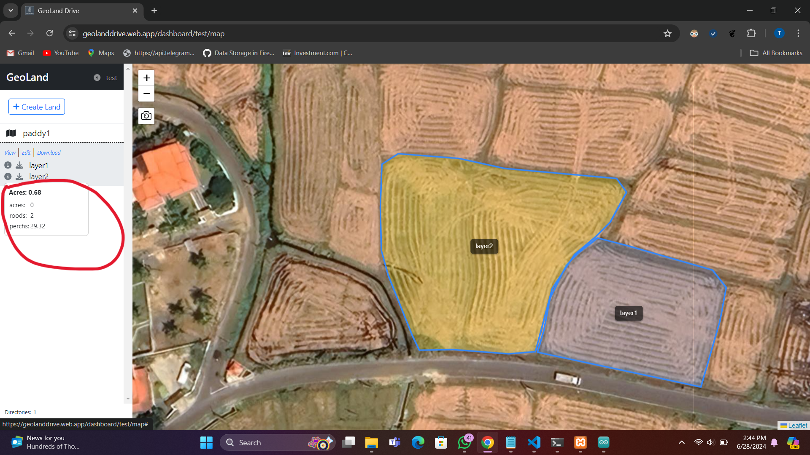

# GeoLand Drive

[GeoLand Drive](https://geolanddrive.web.app/)

GeoLand Drive is a simple web tool for managing KML files, designed to make land measurement and project management easy and efficient.

## Features

1. **Create Multiple Projects**: Organize your work by creating and managing multiple projects.
2. **Create Multiple Lands with Layers in One Map**: Add multiple lands with distinct layers to a single map.
3. **Measure Layers or Whole Project**: Measure individual layers or the entire project area.
4. **Area in Acres or Acres + Roods + Perchs**: Choose your preferred unit of measurement.
5. **Easy to Use**: User-friendly interface designed for simplicity.
6. **Local Browser Storage**: Save your data locally in your browser.
7. **No Cloud Access Required**: All data is stored locally, ensuring privacy and offline accessibility.

## Technology Stack

- **Leaflet-js**: For interactive maps.
- **Vue Framework**: For building the user interface.

## Instructions

1. **Clone the repository**:
    ```bash
    git clone https://github.com/tharushaudana/geolanddrive.git
    ```

2. **Install packages**:
    ```bash
    npm install
    ```

3. **Run the project**:
    ```bash
    npm run dev
    ```

4. **Build the project**:
    ```bash
    npm run build
    ```

## Screenshots

- **Home page**: 
- **Projects page**: 
- **Map page**: 
- **Land measuring**: 
- **Whole Project measuring**: 
- **Multiple land sample**: 

## Background

I developed this tool during Sri Lanka's agriculture land measuring project named "GeoGoviya" where my mother is an officer. We faced challenges in managing and drawing lands on the map using Google Earth Pro, which was not user-friendly for all officers. This simple solution aims to address those challenges.

I hope this tool will be helpful and valuable for you.